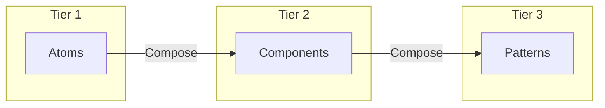
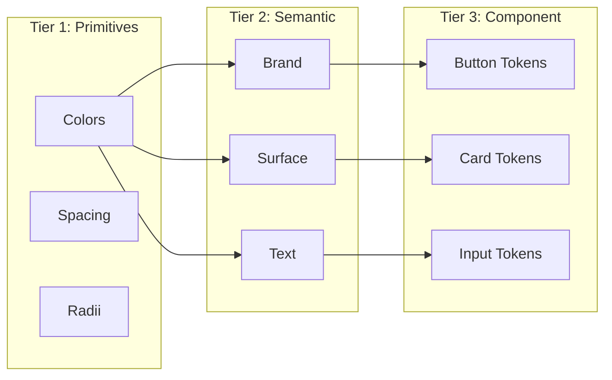
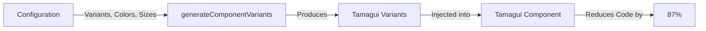

# Design System Builder - Technical Architecture

## 🏗️ Overview

This document defines the technical architecture for a **B2C-focused, cross-platform design system builder** that exports comprehensive megaprompts for CLI-based code generation. The system prioritizes visual customization for branded consumer apps across iOS, Android, and Web.

---

## 🎯 Core Architecture Principles

1. **Token-First Design** - Everything derives from a 3-tier token system
2. **Framework-Agnostic Core** - Abstract model translates to any target
3. **Cross-Platform Native** - Tamagui enables true iOS/Android/Web support
4. **Megaprompt as Product** - The export is a comprehensive instruction set, not config files
5. **Visual-to-Code Bridge** - Live preview directly maps to generated code
6. **Atomic Design Hierarchy** - UI organized as Atoms → Components → Patterns

---

## 📸 System Architecture

The following diagram illustrates the high-level data flow from user interaction to code generation:

```mermaid
graph TD
    User[User] -->|Interacts| UI[Builder UI (Sidebar/Canvas)]
    UI -->|Updates| Store[Zustand Store]
    Store -->|Triggers| Hook[useTokenSystem]
    Hook -->|Updates| CSS[CSS Variables]
    CSS -->|Reflects in| Tamagui[Tamagui Config]
    Tamagui -->|Renders| Preview[Live Preview]
    Store -->|Generates| Mega[Megaprompt]
    Mega -->|Exports| Code[Production Code]
```

---

## 🎨 UI Architecture: 3-Tier Hierarchy

The builder's interface uses an **Atomic Design-inspired** organization that makes the design system intuitive for end users:



### Tier 1: Atoms (Foundational Tokens)
Fundamental design decisions that establish the visual language:

| Atom Category | What It Controls | Example Values |
|---------------|------------------|----------------|
| Typography | Font scales, weights, line heights | Display: 48px/56px @ 700 |
| Colors | Brand, semantic, status colors | Primary: oklch(0.55 0.22 160) |
| Spacing | Layout rhythm (8-pt grid) | $1=8px, $2=16px, $3=24px |
| Radii | Corner roundness | sm=4px, md=8px, lg=12px |
| Shadows | Elevation/depth cues | Level 1, 2, 3 |
| Motion | Duration, easing curves | base=300ms, ease-standard |
| Haptics | Tactile feedback types | light, medium, success |

### Tier 2: Components
Individual UI elements built with Tamagui, consuming atom tokens:

- **Buttons** - Primary, secondary, outline variants
- **Cards** - Elevated, flat, gradient
- **Form Controls** - Input, TextArea, Switch, Checkbox
- **Typography** - Display, H1-H3, Body, Caption (demos only in Components)
- **Tabs** - Navigation within sections
- **Progress** - Bars, indicators
- **Overlays** - Dialog, Sheet, Modal

### Tier 3: Patterns
Composed layouts combining multiple components for common use cases:

- **App Header** - Logo + title + action buttons
- **Navigation Bar** - Tab bar / bottom navigation
- **Form Layout** - Label + input + validation message
- **Card Grid** - Responsive grid of content cards
- **Modal Pattern** - Dialog header + content + action buttons

---

## 🪙 Token System Architecture

### 3-Tier Token Hierarchy

The entire system's flexibility hinges on this hierarchy, enabling theme switching, dark mode, and multi-brand support:



#### Tier 1: Primitive Tokens (Raw Values)
```typescript
{
  color: {
    primitive: {
      blue: {
        50: 'oklch(0.95 0.02 237)',
        // ...
        500: 'oklch(0.50 0.20 237)', // Base
        // ...
      }
    }
  },
  space: { primitive: { 1: 4, 2: 8, 3: 16 } }
}
```

#### Tier 2: Semantic Tokens (Contextual Mappings)
```typescript
{
  color: {
    semantic: {
      background: {
        default: '{color.primitive.gray.50}',
        _dark: '{color.primitive.gray.950}'
      },
      primary: {
        default: '{color.primitive.blue.500}',
        _dark: '{color.primitive.blue.400}'
      }
    }
  }
}
```

#### Tier 3: Component Tokens (Overrides)
```typescript
{
  component: {
    button: {
      primary: {
        background: '{color.semantic.primary.default}'
      }
    }
  }
}
```

### Color System Using OKLCH & Culori

**Why OKLCH over HSL:**
- Perceptually uniform
- Wide gamut support (P3)
- Predictable gradients

The system uses `culori` to convert OKLCH values to RGB for CSS variables, ensuring compatibility while maintaining perceptual uniformity in the source of truth.

---

## 🧩 Component Architecture

### Component Hierarchy
```
Tamagui Primitive → Styled Component → Composed Component
```

### CVA-Based Variant Model
All components use a structure inspired by Class Variance Authority (CVA), implemented via Tamagui's `styled` or `variants` API.

---

## 🏭 Factory Pattern Architecture

### 87% Code Reduction Strategy

The factory pattern reduces component code by abstracting common patterns into functional generators. This is implemented via helper functions like `generateComponentVariants` rather than class inheritance.



#### Implementation
```typescript
// factories.ts
export function generateComponentVariants(config) {
  const variants = {};
  
  if (config.colors) {
     // Generate primary, secondary, danger, etc.
  }
  
  if (config.sizes) {
     // Generate sm, md, lg based on sizing tokens
  }
  
  return variants;
}
```

#### Usage in Component
```typescript
const Button = styled(Stack, {
  variants: {
    ...generateComponentVariants({
      colors: true,
      sizes: true,
      states: true
    })
  }
})
```

---

## 🤖 Megaprompt Architecture

### Megaprompt Structure

The megaprompt is a comprehensive XML-structured instruction set:

```xml
<DesignSystemMegaprompt version="1.0">
  <Metadata>...</Metadata>
  <SystemPersona>...</SystemPersona>
  <ProjectSetup>...</ProjectSetup>
  <TokenSystem>...</TokenSystem>
  <ComponentLibrary>...</ComponentLibrary>
  <AdherenceRules>...</AdherenceRules>
</DesignSystemMegaprompt>
```

---

## 🔄 State Management Architecture

### Zustand Store & CSS Bridge

The system maintains a bidirectional bridge between Zustand state and CSS variables via the `useTokenSystem` hook.

```typescript
// useTokenSystem.ts
export function useTokenSystem(theme) {
  const { ... } = useDesignSystem(); // Zustand

  useEffect(() => {
    // 1. Convert OKLCH to RGB
    // 2. Map Semantic Tokens -> CSS Variables
    // 3. Update DOM
    root.style.setProperty('--color-primary', primaryValue);
  }, [theme, ...]);
}
```

---

## 🎯 Platform-Specific Handling

### Platform Detection and Adaptation
- **iOS**: SF Pro Display, native shadows, haptics
- **Android**: Roboto, elevation, ripple effects
- **Web**: system-ui, hover states, focus rings

---

## 📊 Performance Optimization

1. **Token Caching**: Computed values cached (via `useMemo`)
2. **Lazy Loading**: Components loaded on-demand
3. **CSS Variables**: Cheap updates for theming without React re-renders for every node

---

## 🚀 Deployment Architecture

### Static Hosting (MVP)
```
Vercel/Netlify
├── Static React App (Vite)
├── Client-side generation
└── No backend required
```

---

**Last Updated:** 2026-01-15
**Version:** 1.1 (Visual Update)
**Architecture Status:** Implementation In Progress
